### Team Members: Sohaib Mohiuddin, Umar Riaz, Yusuf Shaik, Curtis Whall

# Chalkboard - University Database System
This is a university database system that currently supports 4 users: Admin, Professor and Student. Every user has a set of views that they can see to control what each user is permitted to do using the system.

## How to Use:
### Brief Explanation:
This system can be implemented using localhost with the assistance of WAMP (Windows, Apache, MySQL, and PHP/Python/Perl). Once WAMP is running and the **connection.php, app.py, data.py** file is modified with correct PhpMyAdmin username and password, localhost can be accessed and the system can be used.

### Steps:
1. Install WAMP from [HERE](http://www.wampserver.com/en/).
2. Launch Wampserver64 then go to the system icon tray at the bottom right to make sure all 3 services are running (Green WAMP Icon):
  
3. Go to "C:\wamp64\www" and place the project folder (**data-project / data-project** (The main directory is called data-project and sub-directory has the same name. You must put the sub-directory in the "www" directory)) in the "www" directory.
4. PhpMyAdmin can be accessed by going to [http://localhost/phpmyadmin/](http://localhost/phpmyadmin/).
5. By Default, the login for phpMyAdmin is:
    - Username: "_root_"
    - Password: " " (By default, no password for root user)
6. Import database file: school_yshaik.sql (_student table, professor table and courses table must be imported into database first due to foreign keys and these three tables hold the root of most foreign keys_).
7. **_IMPORTANT: Go to the data-project directory and open the following files and make the edits as shown in the screenshots below:_**
    - connection.php  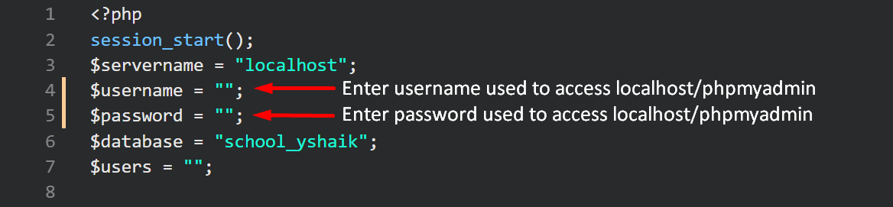
    - app.py  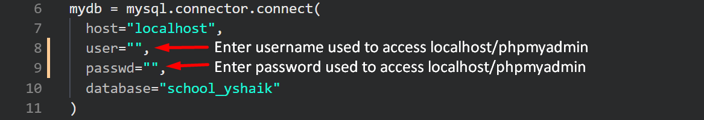
    - data.py  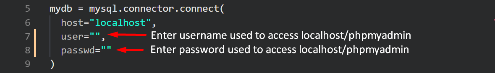
8. Once the database is imported into phpMyAdmin successfully and the project folder is in the "www" directory, go to [login.php](http://localhost/data-project/login.php).
9. If the login page has successfully loaded, go to [Available Usernames and Passwords](#usernames) to view the credentials needed to login.

### Instructions for Weather Application

To only view weather application functionality (No database implementation) Visit: https://trusted-weather.herokuapp.com/?search=los+angeles

To run server localy (with database implementation):
- Open command prompt
- Make sure you have python3 installed
- Navigate to project folder: "cd directory_here"
- Make sure you are in the same directory as app.py
- Install dependencies:
	- pip install requests
	- pip install gunicorn
	- pip install flask
- run server using: "flask run"

### Instructions for API Creation
- Open command prompt
- make sure you have python3 installed
- Navigate to project folder
- make sure you are in the same directory as data.py
- Install dependencies
	- pip install mysql.connector
- Run program using "py data.py"
- file with .json extension can now be found in directory with database information in JSON format

## Views

**Some view have been modified slightly from the views presented in Phase II to meet the functionality**

1. Grades of the student currectly logged in:  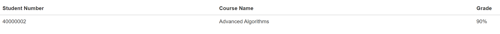

 

2. Grades of students that have over 80% but are not enrolled in Engineering:  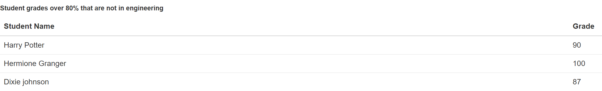

 

3. Reviews of any professor that the logged in student has submitted:  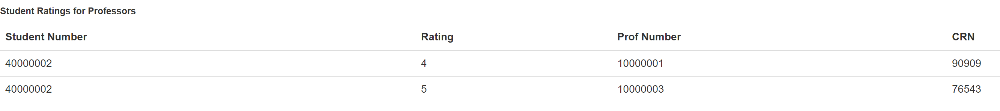

 

4. Courses of the student that is currently logged in:  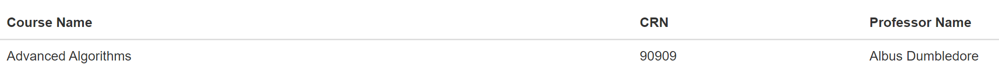

 

5. Grades of the students that are enrolled in Engineering:  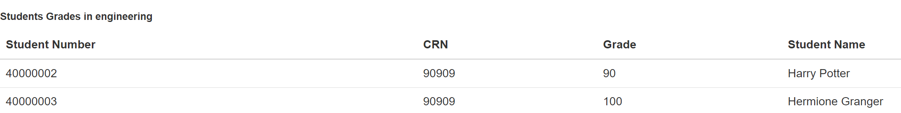

6. Full Join - Student information along with their cumulative grade:  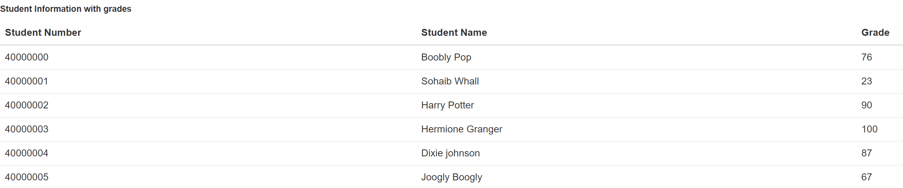

7. Any professor that has a rating of 3:  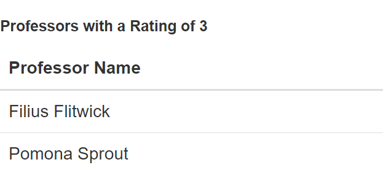

8. Student information and grade of those students that have a higher grade than the average grade:  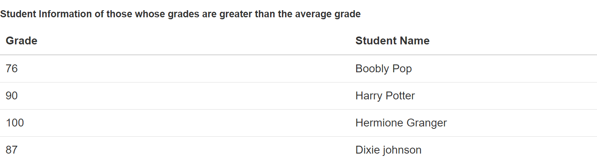

9. Student number of those students whose grades are less than 50%:  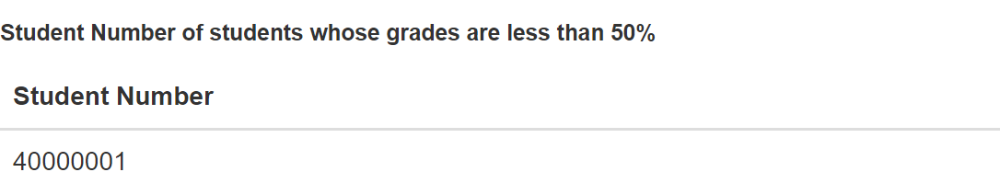

10. Student information of those students that are enrolled in Engineering:  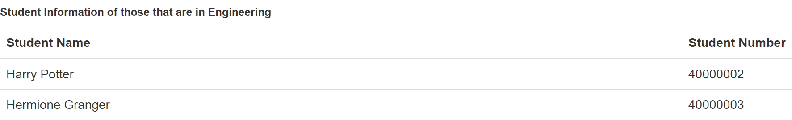

11. Review Submission Form:  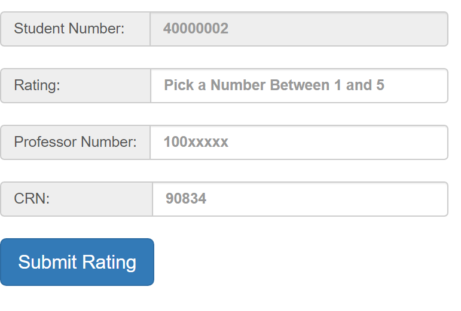

___

#### Available Usernames/Passwords to log into Chalkboard
Student:
- Username: 40000000, Password: testing0
- Username: 40000001, Password: testing0
- Username: 40000002, Password: testing0
- Username: 40000003, Password: testing0
- Username: 40000004, Password: testing0
- Username: 40000005, Password: testing0

Professor:
- Username: 10000000, Password: prof0
- Username: 10000001, Password: prof1
- Username: 10000002, Password: prof2
- Username: 10000003, Password: prof3
- Username: 10000004, Password: prof4
- Username: 10000005, Password: prof5
- Username: 10000006, Password: prof6

Admin:
- Username: 20000000, Password: admin